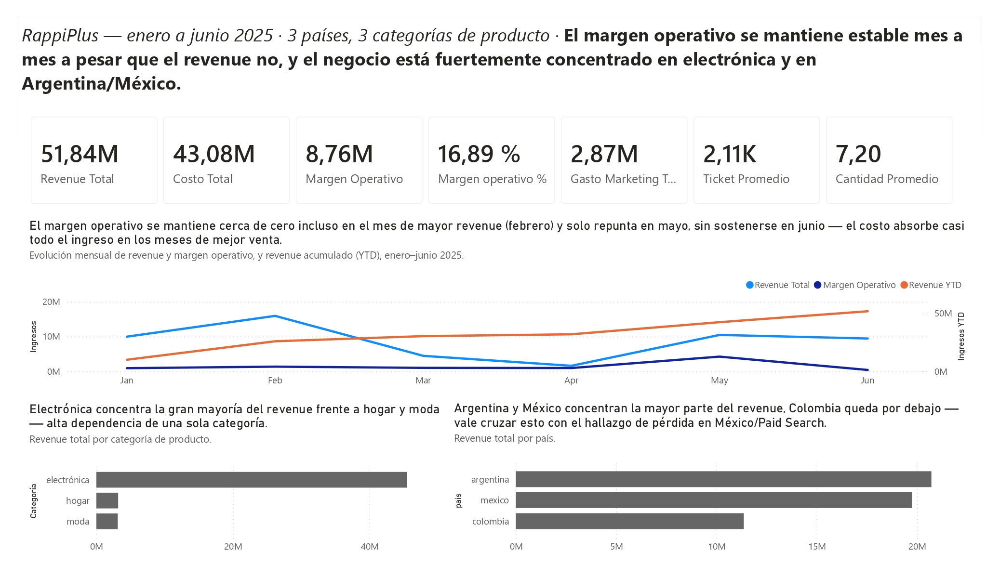
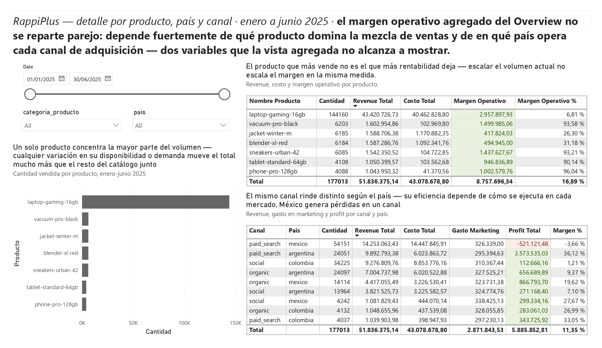
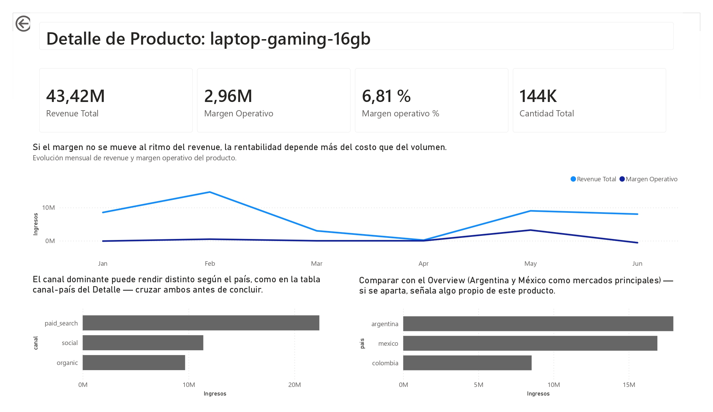

# RappiPlus: From Data to Business Decisions

**An end-to-end data analytics project** — from raw data validation to an executive BI dashboard — built to answer one question: *is the business performing the way it needs to, and where should it act next?*


## 📌 Project Overview

RappiPlus is a subscription-based delivery service operating across three countries (Colombia, Mexico, Argentina) and three acquisition channels (organic, paid search, social). This project evaluates its performance end-to-end — data reliability, profitability, user conversion, retention, and the impact of a product experiment — and packages the results into a decision-ready dashboard for stakeholders.

The project applies the full analytics stack expected of a data analyst: Python for data cleaning and exploratory analysis, SQL for behavioral analytics on a relational database, inferential statistics for experimentation, and Power BI for stakeholder communication.

## 🗂️ Data Sources

- `rappiplus_orders_raw.csv` — order-level transactions: pricing, discounts, revenue
- `rappiplus_catalog.csv` — product catalog: unit cost, category, supplier
- `rappiplus_marketing_spend.csv` — marketing investment by country and channel
- `events`, `users`, `user_activity` (PostgreSQL) — in-platform user behavior
- `experiment_checkout_ui.csv` — results of an A/B test on the checkout UI

## 🔎 Methodology

The analysis follows six sequential stages, each building on the previous one:

1. **Data Quality (Python)** — Diagnosed and cleaned three datasets using a reusable set of validation functions: null and duplicate handling, invalid-numeric checks, date parsing, categorical standardization, and IQR-based outlier detection.
2. **Profitability (Python)** — Joined orders, catalog, and marketing data to calculate revenue, cost, profit, margin, and sales-behavior KPIs by product, country, and channel.
3. **Conversion Funnel (SQL)** — Built a multi-stage funnel using CTEs over PostgreSQL to identify exactly where users drop off between first visit and purchase.
4. **Cohort Retention (SQL)** — Modeled weekly retention (weeks 1–3) across 22 weekly cohorts using date-based grouping and cohort aggregation logic.
5. **A/B Testing (Python)** — Ran a two-proportion Z-test (`statsmodels`) to evaluate whether a checkout UI redesign improved conversion.
6. **Dashboard (Power BI)** — Designed a two-tier executive/drill-through dashboard applying SCQA storytelling, visual hierarchy, and a professional color system.

## 📊 Key Findings

**1. The business is profitable overall, but one segment is bleeding money.**
Revenue reached $51.8M with a net profit of +$5.89M (11.35% margin). Argentina / Paid Search was the strongest segment (+$3.57M), while Mexico / Paid Search operated at a loss (-$521K) — a clear signal for a channel-level cost and pricing audit.

**2. Checkout is the single biggest leak in the funnel.**
Of 7,796 users who visited the platform, 80.04% converted to a purchase — a healthy overall rate. But the transition from `begin_checkout` to `add_payment_info` alone accounted for a 13.29% drop (958 users), more than double any other step, pointing to the payment form as the top UX priority.

**3. Retention decays steadily, with one identifiable outlier cohort.**
Across 22 weekly cohorts (Jan–Jun 2025), average retention fell from ~86% in week 1 to ~64% in week 3. The week-18 cohort (late April) underperformed the best cohort (week 6) by nearly 10 percentage points in weeks 2–3, worth investigating for acquisition-source or seasonality effects.

**4. The tested checkout redesign did not move the needle.**
Conversion was 15.69% (control) vs. 16.29% (treatment) — a difference statistically indistinguishable from chance (z = -0.81, p = 0.4161, α = 0.05). Recommendation: do not ship this change; test a different design hypothesis instead.

## 📈 Dashboard

The Power BI dashboard translates these findings into two views:
- **Executive Overview** — revenue, profit, marketing spend, and ticket-size KPIs, with monthly and YTD trends.
- **Detail / Drill-Through** — an order-level table with conditional formatting and product drill-through, for stakeholders who want to go from KPI to individual order.





## 🛠️ Skills Applied

- **Python & Data Wrangling** — pandas, reusable data-quality functions, null/duplicate handling, IQR outlier detection, reproducible random imputation (fixed seed)
- **SQL** — CTEs, date truncation, cohort logic, querying PostgreSQL via SQLAlchemy
- **Statistics** — hypothesis testing, two-proportion Z-test, p-value interpretation, statistical vs. practical significance
- **BI & Data Storytelling** — Power BI (DAX, drill-through, conditional formatting, date tables), the SCQA framework, dashboard information hierarchy
- **Business Analysis** — KPI design, segment-level profitability analysis, translating findings into stakeholder-ready recommendations

## 🧰 Tech Stack

Python (pandas, numpy, matplotlib, statsmodels) · SQL (PostgreSQL, SQLAlchemy) · Power BI

## 📁 Repository Structure

```
├── notebook/
│   └── RappiPlus_Analysis.ipynb        # Full analysis: Steps 1–5 (Python + SQL)
├── dashboard/
│   ├── Dashboard_RappiPlus.pbix        # Power BI file (Step 6)
│   └── screenshots/                    # Dashboard preview images
└── README.md
```

## ▶️ How to Reproduce This Analysis

1. Clone the repository.
2. Install dependencies: `pip install pandas numpy matplotlib statsmodels sqlalchemy psycopg2-binary`
3. Steps 1, 2, and 5 run directly against the provided CSVs from within the notebook.
4. Steps 3 and 4 require a PostgreSQL connection with the `events`, `users`, and `user_activity` tables — update the connection string in the notebook's setup cell with your own credentials.
5. Open `Dashboard_RappiPlus.pbix` in Power BI Desktop to explore Step 6 interactively.


## 📬 Contact

**[Camilo Rojas]** — [LinkedIn](https://linkedin.com/in/camilo-andres-rojas-rojas) — [camilo35546@gmail.com](mailto:camilo35546@gmail.com)
